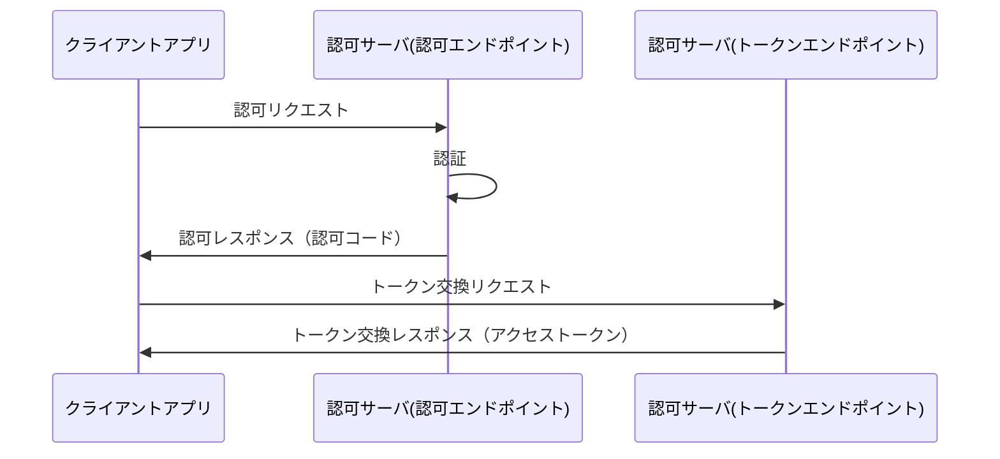
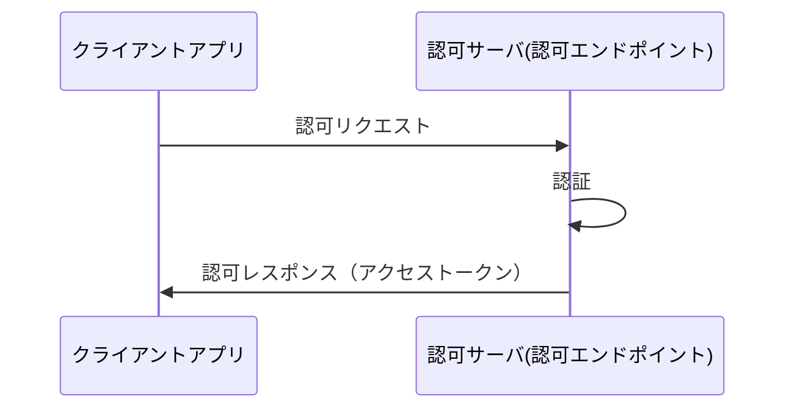

# OAuth2.0とOpen ID Connect（OAuth2.0認可フロー編）

OAuth2.0とOpen ID Connectの実装について、  
主にこれらを使用するアプリケーションの目線で説明する

## 「認証」と「認可」

まず、本文章を読むにあたって上記の言葉の違いについて明確にする

### 認証 とは

ユーザに対する本人確認  
あるサービスのログインで、  
アクセスしてきたユーザが自称するサービス上のアカウントと  
アクセスしてきたユーザ本人が一致すること を確認すること  
例：パスワード認証 指紋認証

### 認可 とは

ユーザに対する権限設定。   
ユーザに対して、特定の操作やデータへのアクセスを許可すること  
例：TwitterやFacebookのアカウント連携設定時に表示される画面（「***に下記の操作を許可しますか？」と表示される画面）

## OAuth2.0 と Open ID Connect

### OAuth2.0 とは

OAuth2.0とは認可を行うための仕様  
あるリソース(Googleのアカウント情報)を別のWebサービス(Qiita等)に提供するための仕様  
OAuth1.0も存在するがOAuth2.0に置き換わり廃止されている  

### Open ID Connect とは
Open ID Connect（以下OIDC）とはOAuth2.0を拡張することで、  
認証の情報を提供するための仕様  
「認証の情報を提供する」という点のみで、認証の方式についてここで定められているわけではない  
OAuth2.0単体でも認証の情報を提供することは可能だが、標準的に定められた仕様はない

## 認可の流れ

上述の通り、認可を行う仕様についてはOAuth2.0で定められている
下記でOAuth2.0に基づいた認可の流れを説明する    

### アクセストークン

アクセストークンとはクライアントアプリに対して、認可サーバが発行する認可を表す文字列である。
OAuth2.0で定められる認可フローとは、  
認可サーバがクライアントアプリにアクセストークンを提供するための仕様である  

アクセストークンは最低限「アクセス範囲」と「有効期限」を持つ必要がある  
アクセス範囲は後述する`scope`として定義される

アクセストークンのタイプ（受け渡し方法）は下記の2種類があります  
どちらが使用されるかは認可サーバの実装に依存し、OAuth2.0の仕様ではユーザはどちらのタイプを使用するか選ぶことはできません。

- Bearer  
  署名なしトークン  
  トークンタイプとしての署名が行われないトークン  
  しかし、トークンの実装としてJWTを用いることでトークンの署名が可能  
  現在の多くの認可サーバではこちらのタイプが使用されている  
  推奨事項として下記がある  
  - 保護されるべき情報を使用してはならず参照であるべき(MUST)
  - TLS(https)を常に有効化にする必要がある(MUST)
  - Cookieに保存してはいけない(MUST)
  - 有効期限は短くするべき（1時間以内）(SHOULD)
  - URL(パラメータ、フラグメント)で渡してはいけない（SHOULD）
- MAC  
  署名ありトークン  
  アクセストークン含めリソースサーバへのリクエストまるごと（Method,URL,Body）を含め署名が行われる  

アクセストークン本体の実装（トークンフォーマット）に関する仕様はないが
実装の方法に大別して下記の3通がある
どれが使用されるかは認可サーバの実装に依存し、OAuth2.0の仕様ではユーザはどのタイプを使用するか選ぶことはできません。
- 識別子型    
  完全にランダムな文字列をアクセストークンとして使用する方式  
  アクセストークンに紐づく認可情報（有効期限等を含む）は認可サーバ上のアクセストークンテーブルに保存される。  
  アクセストークンの検証には上記のテーブルに問い合わせる必要がある  
  この方式は個別のアクセストークンの失効を簡単に行える  
  しかし、アクセストークンの検証のために毎回認可サーバに問い合わせる必要がある  
- 内包型  
  アクセストークンに紐づく内容をアクセストークン内に埋め込む方式  
  この方式のフォーマットはJWTを用いることが主流  
  この方式の場合はトークンの検証のために毎回認可サーバに問い合わせる必要がない  
  しかし、即時に個別のアクセストークンを失効させる方法がない  
- ハイブリッド型  
  内包型のアクセストークンを生成し、その中にアクセストークンの一意情報を埋め込む

### 登場人物

- クライアントアプリ  
  認可を要求するサービス  
  ユーザがスマホやブラウザで直接サービスの提供を受けるもの

- リソースサーバ  
  クライアントアプリがデータ取得を行うサーバ  
  データ取得のためのWebAPIを公開している

- 認可サーバ
  クライアントアプリに対して、リソースサーバへのアクセス権限を付与する  
  合わせてユーザの認証を行う 
  アクセストークンに署名を行った場合、署名を検証するための公開鍵を公開する

認可フローには代表的なもので以下の2種類が存在する  
- 認可コードフロー
- インプリシットフロー

### 認可コードフロー

現在のOAuth2.0及びOIDCの推奨

1. 認可リクエスト  
  クラインアントアプリから認可サーバに対して認可リクエストを発行する  
  具体的には、クライアントアプリから認可リクエストURIに対してリダイレクトさせる  
  認可リクエストURIのパラメータは下記を設定する  

    | key | necessary | value |
    | - | - | - |
    | response_type | 必須 | code |
    | response_mode | 任意 | form_post |
    | client_id | 必須 |  認可サーバ設定時に得られるアプリ識別子 |
    | redirect_uri | 任意 | 認可情報を伝達するためのクライアントアプリ上のURI（絶対URI） |
    | scope | 任意 | 要求する認可の範囲 |
    | state | 任意 | CSRF対策 |

    一部を抜粋して補足
    - response_type  
      インプリシットフローではこのパラメータに`code`を設定する必要がある。  
      他の設定可能な値としてOAuth2.0では`token`が可能だが、  
      これは「インプリシットフロー」の際に設定する
    - reponse_mode  
      認可情報を発行しそれを共有するためにリダイレクトされるURIにどのように渡されるかの設定
      認可コードフローのデフォルトの設定は`query`となっている  
      この設定ではブラウザ上に認可情報が記録される可能性があるため、`form_post`を設定するのが安全である  
      ここで設定することができる値は下記  
      - `fragment` : URLフラグメント  
      - `query` : URLパラメータ（デフォルト）  
      - `form_post` : FormのPOST（推奨）  
    - redirect_uri    
      これは、認可ページのクライアントアプリとは別のドメインからリダイレクトされる可能性があるため、絶対URIでなくてはならない  
      ここで使用するURIは事前に認可サーバに登録しておく必要がある  
      ここでのURLフラグメントの使用は禁止されている  
      そのため、`vue-router`のようにフラグメントでルーティングされるページへはリダイレクトできない
    - scope  
      要求する認可の範囲を指定する   
      設定する値は認可サーバに定義される
      認可サーバに定義されるscopeの中で必要な権限をこのパラメータに設定する  
      例：email
    - state  
      CSRF対策としてランダムな文字列を設定する  
      これはリクエストとリダイレクト間で状態を維持するために使用される  
      クライアントアプリはリダイレクトを受け取るまでこの文字列を記憶する必要がある 

1. 認証  
  認可サーバ内もしくは連携している別の認可サーバで認証を行う
  認証についての使用はAuth2.0では定められていない。

1. 認可レスポンス  
  認証に成功し要求している認可が認められた場合に認可レスポンスが発行される  
  認可内容がどのように渡されるかは認可リクエストの`reponse_mode`の値に準ずる  
  認可レスポンスとして下記の値が提供される

    | key | necessary | value |
    | - | - | - |
    | code | 必須 | 認可コード |
    | state | 条件 | CSRF対策 |

    - code  
      認可コード  
      後述するトークン交換リクエストに使用する
    - state  
      認可リクエストで設定した値がそのまま設定される  
      クライアントアプリはこの値が認可リクエストで設定した値と同一であることを確認する必要がある  
  
1. トークン交換リクエスト  
  認可レスポンスで受け取った認可コードとアクセストークンを交換するリクエスト行う  

    クライアントアプリは認可サーバが提供するトークンエンドポイントに対して  
    下記のパラメータを付与したリクエスト行う

    | key | necessary | value |
    | - | - | - |
    | grant_type | 必須 | authorization_code |
    | code | 必須 | 認可コード |
    | redirect_uri | 条件 | 認可リクエストで設定した値 |
    | client_id | 必須 |  認可サーバ設定時に得られるアプリ識別子 |

    一部を抜粋して補足
    - grant_type  
      トークン交換に用いるデータのタイプ  
      他の選択肢には`refresh_token`（リフレッシュトークンを用いたトークン交換）がある  
    - code  
      認可レスポンスで取得した認可コード  
      同様の認可コードで複数回トークン交換リクエストが行われた場合、それまでのアクセストークンが無効化される可能性がある（認可サーバの実装要件がSHOULD）  
    - redirect_uri  
      認可リクエストで設定した値を同一の値を設定する  
      実際にリダイレクトが行われるわけではない

1. トークン交換レスポンス  
  アクセストークンの交換に成功した場合、下記のデータが得られる。

    | key | necessary | value |
    | - | - | - |
    | access_token | 必須 | アクセストークン |
    | token_type | 必須 |  |
    | expires_in | 推奨 | token |
    | refresh_token | 任意 | 認可の範囲 |

    ※ここでのnecessaryとは認可サーバ実装における必要性  
    必須でない項目は認可サーバによって提供されない可能性がある

    - access_token  
      上述の「アクセストークン」を参照
    - token_type  
      上述の「アクセストークン」を参照
    - expires_in  
      アクセストークンが有効な期間を秒で表したもの  
      `3600`なら1時間  
      この値が設定されていない場合は別の方法で有効期間が提供される（個別の認可サーバ依存）  
    - scope  
      認可リクエストで要求された`scope`と同一な場合は認可サーバの本パラメータを設定する必要性が`RECOMMENDED（推奨）`となる  
      認可リクエストで要求された`scope`と異なる場合は認可サーバの本パラメータを設定する必要性が`REQUIRED（必須）`となり、認可された範囲が設定される 
    - refresh_token  
      アクセストークンの更新に使用される
    - scope  
      要求する認可の範囲を指定する   
      設定する値は認可サーバに定義される
      認可サーバに定義されるscopeの中で必要な権限をこのパラメータに設定する  
      例：email

### インプリシットフロー

このフロー認可コードフローに比べてシンプルだが、  
脆弱性があるため非推奨となっており、  
認可コードフローの使用が推奨されている。

1. 認可リクエスト  
  クラインアントアプリから認可サーバに対して認可リクエストを発行する  
  具体的には、クライアントアプリから認可リクエストURIに対してリダイレクトさせる  
  認可リクエストURIのパラメータは下記を設定する  

    | key | necessary | value |
    | - | - | - |
    | response_type | 必須 | token |
    | response_mode | 任意 | form_post |
    | client_id | 必須 |  認可サーバ設定時に得られるアプリ識別子 |
    | redirect_uri | 任意 | 認可情報を伝達するためのクライアントアプリ上のURI（絶対URI） |
    | scope | 任意 | 要求する認可の範囲 |
    | state | 任意 | CSRF対策 |

    一部を抜粋して補足
    - response_type  
      インプリシットフローではこのパラメータに`token`を設定する必要がある。  
      他の設定可能な値としてOAuth2.0では`code`が可能だが、  
      これは「認可コードフロー」の際に設定する
    - reponse_mode  
      認可情報を発行しそれを共有するためにリダイレクトされるURIにどのように渡されるかの設定
      インプリシットフローのデフォルトの設定は`fragment`となっている  
      この設定ではブラウザ上に認可情報が記録される可能性があるため、`form_post`を設定するのが安全である  
      ここで設定することができる値は下記  
      `fragment` : URLフラグメント（デフォルト）  
      `query` : URLパラメータ  
      `form_post` : FormのPOST（推奨）  
      [RFC6749](https://openid-foundation-japan.github.io/rfc6749.ja.html)の策定当初にこのパラメータはなく、[ここ](https://openid.net/specs/oauth-v2-multiple-response-types-1_0.html)と[ここ](https://openid.net/specs/oauth-v2-form-post-response-mode-1_0.html)で追加で定義された
    - redirect_uri    
      これは、認可ページのクライアントアプリとは別のドメインからリダイレクトされる可能性があるため、絶対URIでなくてはならない  
      ここで使用するURIは事前に認可サーバに登録しておく必要がある  
      ここでのURLフラグメントの使用は禁止されている  
      そのため、`vue-router`のようにフラグメントでルーティングされるページへはリダイレクトできない
    - scope  
      要求する認可の範囲を指定する   
      設定する値は認可サーバに定義される
      認可サーバに定義されるscopeの中で必要な権限をこのパラメータに設定する  
      例：email
    - state  
      CSRF対策としてランダムな文字列を設定する  
      これはリクエストとリダイレクト間で状態を維持するために使用される  
      クライアントアプリはリダイレクトを受け取るまでこの文字列を記憶する必要がある  

1. 認証  
  認可サーバ内もしくは連携している別の認可サーバで認証を行う
  認証についての使用はAuth2.0では定められていない。

1. 認可レスポンス  
  認証に成功し要求している認可が認められた場合に認可レスポンスが発行される  
  認可内容がどのように渡されるかは認可リクエストの`reponse_mode`の値に準ずる
  認可レスポンスとして下記の値が提供される

    | key | necessary | value |
    | - | - | - |
    | access_token | 必須 | アクセストークン |
    | token_type | 必須 |  |
    | expires_in | 推奨 | token |
    | scope | 条件 | 認可の範囲 |
    | state | 条件 | CSRF対策 |
    
    ※ここでのnecessaryとは認可サーバ実装における必要性  
    必須でない項目は認可サーバによって提供されない可能性がある

    一部を抜粋して補足する  
    - access_token  
      上述の「アクセストークン」を参照
    - token_type  
      上述の「アクセストークン」を参照
    - expires_in  
      アクセストークンが有効な期間を秒で表したもの  
      `3600`なら1時間  
      この値が設定されていない場合は別の方法で有効期間が提供される（個別の認可サーバ依存）  
    - scope  
      認可リクエストで要求された`scope`と同一な場合は認可サーバの本パラメータを設定する必要性が`RECOMMENDED（推奨）`となる  
      認可リクエストで要求された`scope`と異なる場合は認可サーバの本パラメータを設定する必要性が`REQUIRED（必須）`となり、認可された範囲が設定される  
    - state  
      認可リクエストで設定した値がそのまま設定される  
      クライアントアプリはこの値が認可リクエストで設定した値と同一であることを確認する必要がある  

## 参考
[RFC6749(OAuth2.0コア仕様)](https://openid-foundation-japan.github.io/rfc6749.ja.html)  
[Oauth2.0 response_mode追加](https://openid.net/specs/oauth-v2-multiple-response-types-1_0.html)  
[OAuth2.0 response_mode form_post](https://openid.net/specs/oauth-v2-form-post-response-mode-1_0.html)  
[OAuth2.0 BearerToken](https://openid-foundation-japan.github.io/rfc6750.ja.html)  
[OAuth2.0 MACToken](https://tools.ietf.org/id/draft-ietf-oauth-v2-http-mac-05.html)
[アクセストークンの実装](https://qiita.com/TakahikoKawasaki/items/970548727761f9e02bcd)
