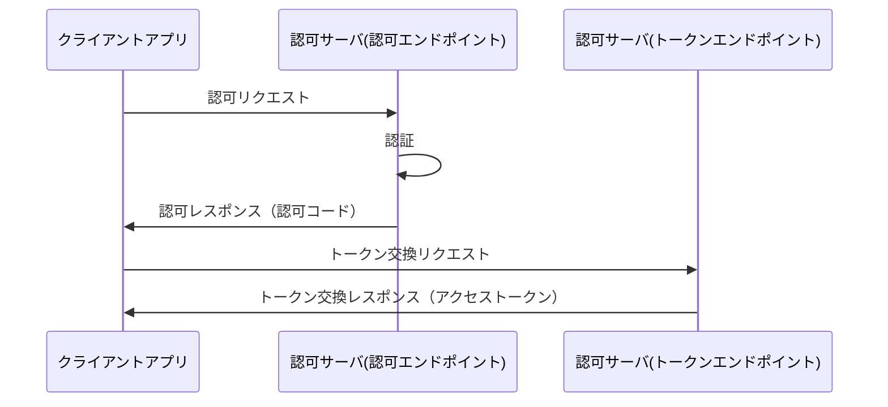
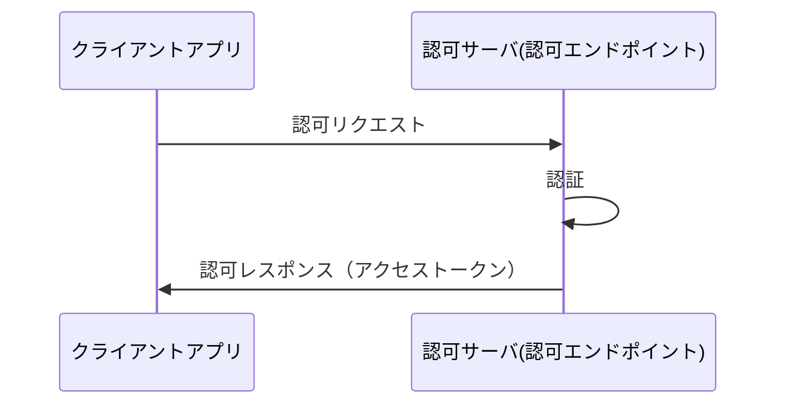

# OAuth2.0とOpen ID Connect（OAuth2.0認可フロー編）

OAuth2.0とOpen ID Connectの実装について、  
主にこれらを使用するアプリケーションの目線で説明する

## 「認証」と「認可」

まず、本文章を読むにあたって上記の言葉の意味を明確にする

### 「認証(Authentication)」 とは

ユーザに対する本人確認  
あるサービスのログインで、  
アクセスしてきたユーザが自称するサービス上のアカウントと  
アクセスしてきたユーザ本人が一致すること を確認すること  
例：パスワード認証 指紋認証

### 「認可(Authorization)」 とは

ユーザに対する権限設定  
ユーザに対して特定の操作やデータへのアクセスを許可すること  
例：TwitterやFacebookのアカウント連携設定時に表示される画面（「***に下記の操作を許可しますか？」と表示される画面）

## OAuth2.0 と Open ID Connect

### OAuth2.0 とは

OAuth2.0とは認可を行うための仕様  
あるリソース(例：Googleのアカウント情報)を別のWebサービス(例：Qiita等)に提供するための「認可」を行う仕様  
OAuth1.0も存在するがOAuth2.0に置き換わり廃止されている  

### Open ID Connect とは
Open ID Connect（以下OIDC）とはOAuth2.0を拡張することで、  
認証の情報を提供するための仕様  
「認証の情報を提供する」という点のみで、認証の方式についてここで定められているわけではない  
OAuth2.0単体でも認証の情報を提供することは可能だが、標準的に定められた仕様はない

## 認可の流れ

上述の通り、認可を行う仕様についてはOAuth2.0で定められている  
下記でOAuth2.0に基づいた認可の流れを説明する  

### アクセストークン

認可サーバのがクライアントに発行する認可を表す文字列  
OAuth2.0で定められる認可の仕組みの核は、  
認可サーバがクライアントにアクセストークンを提供するための仕様である  

アクセストークンは最低限「アクセス範囲」と「有効期限」を持つ必要がある  
「アクセス範囲」は後述する`scope`として定義される

アクセストークンのタイプ（HTTPリクエストとしてのアクセストークンの提供方法）は下記の2種類がある  
どちらが使用されるかは認可サーバの実装に依存する  
OAuth2.0の仕様ではクライアントがどちらのタイプを使用するか選ぶことはできない  

- bearer  
  署名なしトークン  
  トークンタイプとしての署名が行われないトークン  
  トークンのフォーマットとしてJWTを用いることでトークンの署名が可能  
  現在の多くの認可サーバではこちらのタイプが使用されている  
  トークンの受け渡し方法として下記が定義される  
  - `Authorization`ヘッダ  
    HTTPリクエストのヘッダとして下記を含める  
    `Authorization: Bearer アクセストークン`
    使用するブラウザが`Authorization`ヘッダに対応できない場合を除いて、この方式を使用すべきである
  - ボディパラメータ
    下記の形式でHTTPリクエストのボディに含めることができる  
    `access_token=アクセストークン`  
    この方式を使用する場合は下記の条件を満たす必要がある  
  - `Content-Type`ヘッダに`application/x-www-form-urlencoded`を設定する  
  - `application/x-www-form-urlencoded`のエンコードを行う
  - ボディがシングルパートで無ければならない(`Content-Type`に`multipart/form-data`は使用できない)
  - エンコードされたボディの文字列はASCIIで無ければならない
  - GETメソッドを使用してはいけない

  推奨事項として下記がある  
  - 保護されるべき情報を使用してはならず参照であるべき(MUST)
  - TLS(https)を常に有効化にする必要がある(MUST)
  - Cookieに保存してはいけない(MUST)
  - 有効期限は短くするべき（1時間以内）(SHOULD)
  - URL(パラメータ、フラグメント)で渡してはいけない（SHOULD）
- mac   
  署名ありトークン  
  ここでは署名ありHTTPリクエストを作成する  
  HTTPリクエストのヘッダに下記を含める必要がある  
  ```
  Authentication: MAC/
                  token="アクセストークン"/
                  timestamp="現在のタイムスタンプ"/
                  nonce="ランダム文字列"/
                  signature="署名文字列"
  ```
  署名文字列の生成方法の解説は割愛する    
  気になる場合は[ここ](https://tools.ietf.org/id/draft-ietf-oauth-v2-http-mac-05.html)を参照  

アクセストークンのフォーマットに関する仕様はOAuth2.0に定義はなく認可サーバーに依存するが、  
実装の方式は大別して下記の3通りがある  
- 識別子型    
  一意なランダム文字列をアクセストークンとして使用する方式  
  アクセストークンに紐づく認可情報（スコープや有効期限等）は認可サーバ上のアクセストークンをキーとしたテーブルで保持される  
  アクセストークンの検証には上記のテーブルへの問い合わせが必要  
  メリット：個別のアクセストークンの失効を即時に行える  
  デメリット：アクセストークンの検証に認可サーバへの問い合わせが必要  
- 内包型  
  アクセストークンに紐づく認可情報をアクセストークン内に埋め込む方式  
  この方式のフォーマットはJWTを用いることが多い  
  Auth0ではこの方式が用いられる  
  メリット：アクセストークンの検証に認可サーバへの問い合わせが不要  
  デメリット：即時に個別のアクセストークンを失効することができない  
- ハイブリッド型  
  内包型のアクセストークンを生成し、その中にアクセストークンの一意情報を埋め込む  
  アクセストークンの失効確認が必要な場合のみ認可サーバに問い合わせる  

### 登場人物

- クライアントアプリ  
  認可を要求するサービス  
  ユーザがスマホやブラウザで直接サービスの提供を受けるシステム  

- リソースサーバ  
  クライアントアプリがデータ取得を行うサーバ  
  データ取得のためのWebAPIを公開している  

- 認可サーバ
  クライアントアプリに対して、リソースサーバへのアクセス権限を付与する  
  合わせてユーザの認証を行う  
  アクセストークンに署名を行った場合、署名を検証するための情報を公開する  

認可フローには代表的なもので以下の2種類が存在する  
- 認可コードフロー
- インプリシットフロー

### 認可コードフロー

現在のOAuth2.0及びOIDCの推奨  



1. 認可リクエスト  
  クラインアントアプリから認可サーバに対して認可リクエストを発行する  
  具体的には、認可リクエストURIに対してリダイレクトさせる  
  認可リクエストURIのパラメータは下記を設定する  

    | key | necessary | value |
    | - | - | - |
    | response_type | 必須 | code |
    | response_mode | 任意 | form_post |
    | client_id | 必須 |  認可サーバ設定時に得られるアプリ識別子 |
    | redirect_uri | 任意 | 認可情報を伝達するためのクライアントアプリ上のURI（絶対URI） |
    | scope | 任意 | 要求する認可の範囲 |
    | state | 任意 | CSRF対策 |

    一部を抜粋して補足
    - response_type  
      認可リクエストの成功時に得られるデータ  
      認可コードフローではこのパラメータに`code`を設定する必要がある  
      他の設定可能な値としてOAuth2.0では`token`が可能だが、  
      これは「インプリシットフロー」の際に設定する  
    - reponse_mode  
      認可情報の共有方法の設定  
      具体的な流れとしては認証の完了後にクライアントのサービスにリダイレクトが行われる  
      その中での認可情報の受け渡し方法  
      認可コードフローのデフォルトの設定は`query`となる  
      この設定では外部に認可情報が記録される可能性があるため、  `form_post`を設定する方が安全である  
      ここで設定することができる値は下記  
      - `fragment` : URLフラグメント  
      - `query` : URLパラメータ（デフォルト）  
      - `form_post` : FormのPOST   
    - redirect_uri  
      認可情報の共有のためにリダイレクトされるURI  
      認可ページのクライアントアプリとは別のドメインからリダイレクトされる可能性があるため、絶対URIでなくてはならない  
      ここで使用するURIは事前に認可サーバに登録しておく必要がある  
      URLフラグメントの使用は禁止されている  
    - scope  
      要求する認可の範囲を指定する   
      設定する可能な値は認可サーバに定義される  
      認可サーバに定義されるscopeの中で必要な最小限の権限をこのパラメータに設定する  
      例：email openid等
    - state  
      CSRF対策としてランダムな文字列を設定する  
      リクエストとリダイレクト間で状態を維持するために使用される  
      クライアントアプリはリダイレクトを受け取るまでこの文字列を記憶する必要がある  

1. 認証  
  認可サーバ内もしくは連携している別の認可サーバで認証を行う  
  認証の仕様はOAuth2.0では定められていない  

1. 認可レスポンス  
  認証に成功し要求している認可が認められた場合に認可レスポンスが発行される  
  認可内容がどのように渡されるかは認可リクエストの`reponse_mode`の値に準ずる  
  認可レスポンスとして下記の値が提供される  

    | key | necessary | value |
    | - | - | - |
    | code | 必須 | 認可コード |
    | state | 条件 | CSRF対策 |
    
    ※ここでのnecessaryとは認可サーバ実装における必要性  
    必須でない項目は認可サーバによって提供されない可能性がある

    - code  
      認可コード  
      後述するトークン交換リクエストに使用する
    - state  
      認可リクエストで設定した値が設定される  
      認可リクエストで指定されなかった場合はこのパラメータは含まれない  
      クライアントアプリはこの値が認可リクエストで設定した値と同一であることを確認する必要がある  
  
1. トークン交換リクエスト  
  認可レスポンスで受け取った認可コードとアクセストークンを交換するリクエスト行う  

    クライアントアプリは認可サーバが提供するトークンエンドポイントに対して下記のパラメータを設定したリクエスト行う

    | key | necessary | value |
    | - | - | - |
    | grant_type | 必須 | authorization_code |
    | code | 必須 | 認可コード |
    | redirect_uri | 条件 | 認可リクエストで設定した値 |
    | client_id | 必須 |  認可サーバ設定時に得られるアプリ識別子 |

    一部を抜粋して補足
    - grant_type  
      トークン交換に用いるデータのタイプ  
      認可コードフローでは`authorization_code`
      他の選択肢には`refresh_token`（リフレッシュトークンを用いたトークン交換）がある  
    - code  
      認可レスポンスで取得した認可コード  
      同様の認可コードで複数回トークン交換リクエストが行われた場合、それまでのアクセストークンが無効化される可能性がある（認可サーバの実装に依存する）  
    - redirect_uri  
      認可リクエストで`redirect_uri`を設定した場合は必須  
      認可リクエストで設定した値を同一の値を設定する  
      実際のリダイレクトは行われない  

1. トークン交換レスポンス  
  アクセストークンの交換に成功した場合、下記のデータが得られる。

    | key | necessary | value |
    | - | - | - |
    | access_token | 必須 | アクセストークン |
    | token_type | 必須 | bearerまたはmac（大文字小文字の区別はない）|
    | expires_in | 推奨 | token |
    | scope | 条件 | 許可された認可の範囲 |
    | refresh_token | 任意 | 認可の範囲 |

    ※ここでのnecessaryとは認可サーバ実装における必要性  
    必須でない項目は認可サーバによって提供されない可能性がある

    - access_token  
      上述の「アクセストークン」を参照
    - token_type  
      上述の「アクセストークン」を参照
    - expires_in  
      アクセストークンが有効な期間  
      単位は秒  
      `3600`なら1時間  
      この値が設定されていない場合は別の方法で有効期間が提供される（認可サーバ依存）  
    - scope  
      認可リクエストで要求された`scope`と同一な場合本パラメータが設定されないことがある（認可サーバ依存）
      認可リクエストで要求された`scope`と異なる場合は認可された範囲  
    - refresh_token  
      アクセストークンの更新に使用する  

### インプリシットフロー

このフロー認可コードフローに比べてシンプルだが脆弱性があるため非推奨となっている  
認可コードフローの使用が推奨されている。



1. 認可リクエスト  
  クラインアントアプリから認可サーバに対して認可リクエストを発行する  
  具体的には、クライアントアプリから認可リクエストURIに対してリダイレクトさせる  
  認可リクエストURIのパラメータは下記を設定する  

    | key | necessary | value |
    | - | - | - |
    | response_type | 必須 | token |
    | response_mode | 任意 | form_post |
    | client_id | 必須 |  認可サーバ設定時に得られるアプリ識別子 |
    | redirect_uri | 任意 | 認可情報を伝達するためのクライアントアプリ上のURI（絶対URI） |
    | scope | 任意 | 要求する認可の範囲 |
    | state | 任意 | CSRF対策 |

    一部を抜粋して補足
    - response_type  
      インプリシットフローではこのパラメータに`token`を設定する必要がある。  
      他の設定可能な値としてOAuth2.0では`code`が可能だが、  
      これは「認可コードフロー」の際に設定する
    - reponse_mode  
      認可情報の共有方法の設定  
      具体的な流れとしては認証の完了後にクライアントのサービスにリダイレクトが行われる  
      その中での認可情報の受け渡し方法  
      インプリシットフローのデフォルトの設定は`fragment`となる  
      この設定では外部に認可情報が記録される可能性があるため、  `form_post`を設定する方が安全である  
      ここで設定することができる値は下記  
      - `fragment` : URLフラグメント（デフォルト）    
      - `query` : URLパラメータ
      - `form_post` : FormのPOST   
    - redirect_uri  
      認可情報の共有のためにリダイレクトされるURI  
      認可ページのクライアントアプリとは別のドメインからリダイレクトされる可能性があるため、絶対URIでなくてはならない  
      ここで使用するURIは事前に認可サーバに登録しておく必要がある  
      URLフラグメントの使用は禁止されている  
    - scope  
      認可リクエストで要求された`scope`と同一な場合本パラメータが設定されないことがある（認可サーバ依存）
      認可リクエストで要求された`scope`と異なる場合は認可された範囲  
    - state  
      CSRF対策としてランダムな文字列を設定する  
      リクエストとリダイレクト間で状態を維持するために使用される  
      クライアントアプリはリダイレクトを受け取るまでこの文字列を記憶する必要がある  

1. 認証  
  認可サーバ内もしくは連携している別の認可サーバで認証を行う
  認証についての使用はAuth2.0では定められていない。

1. 認可レスポンス  
  認証に成功し要求している認可が認められた場合に認可レスポンスが発行される  
  認可内容がどのように渡されるかは認可リクエストの`reponse_mode`の値に準ずる
  認可レスポンスとして下記の値が提供される

    | key | necessary | value |
    | - | - | - |
    | access_token | 必須 | アクセストークン |
    | token_type | 必須 |  |
    | expires_in | 推奨 | token |
    | scope | 条件 | 許可された認可の範囲 |
    | state | 条件 | CSRF対策 |
    
    ※ここでのnecessaryとは認可サーバ実装における必要性  
    必須でない項目は認可サーバによって提供されない可能性がある

    一部を抜粋して補足する  
    - access_token  
      上述の「アクセストークン」を参照
    - token_type  
      上述の「アクセストークン」を参照
    - expires_in  
      アクセストークンが有効な期間  
      単位は秒  
      `3600`なら1時間  
      この値が設定されていない場合は別の方法で有効期間が提供される（個別の認可サーバ依存）  
    - scope  
      認可リクエストで要求された`scope`と同一な場合は認可サーバの本パラメータを設定する必要性が`RECOMMENDED（推奨）`となる  
      認可リクエストで要求された`scope`と異なる場合は認可サーバの本パラメータを設定する必要性が`REQUIRED（必須）`となり、認可された範囲が設定される  
    - state  
      認可リクエストで設定した値がそのまま設定される  
      クライアントアプリはこの値が認可リクエストで設定した値と同一であることを確認する必要がある  

    インプリシットフローではリフレッシュトークンは発行されない

## 参考
[RFC6749(OAuth2.0コア仕様)](https://openid-foundation-japan.github.io/rfc6749.ja.html)  
[Oauth2.0 response_mode追加](https://openid.net/specs/oauth-v2-multiple-response-types-1_0.html)  
[OAuth2.0 response_mode form_post](https://openid.net/specs/oauth-v2-form-post-response-mode-1_0.html)  
[OAuth2.0 BearerToken](https://openid-foundation-japan.github.io/rfc6750.ja.html)  
[OAuth2.0 MACToken](https://tools.ietf.org/id/draft-ietf-oauth-v2-http-mac-05.html)  
[アクセストークンの実装](https://qiita.com/TakahikoKawasaki/items/970548727761f9e02bcd)
